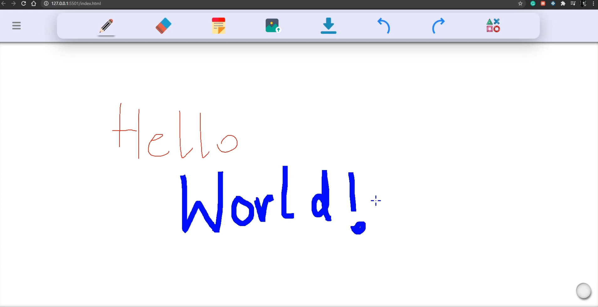
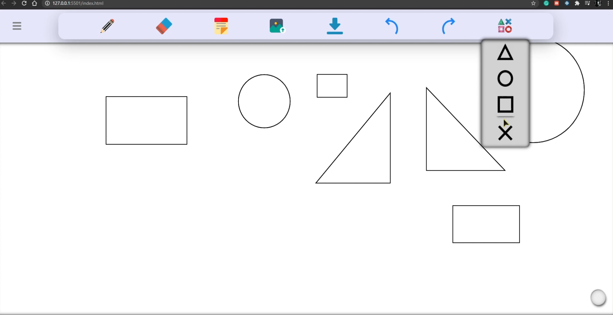
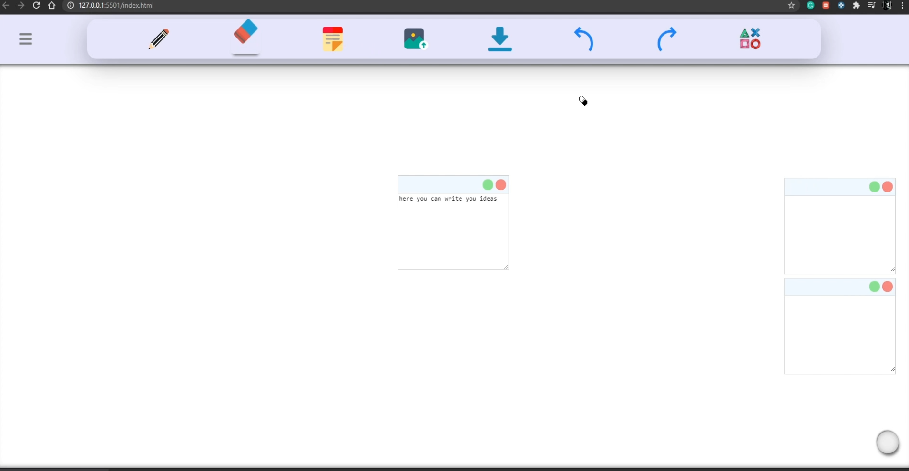
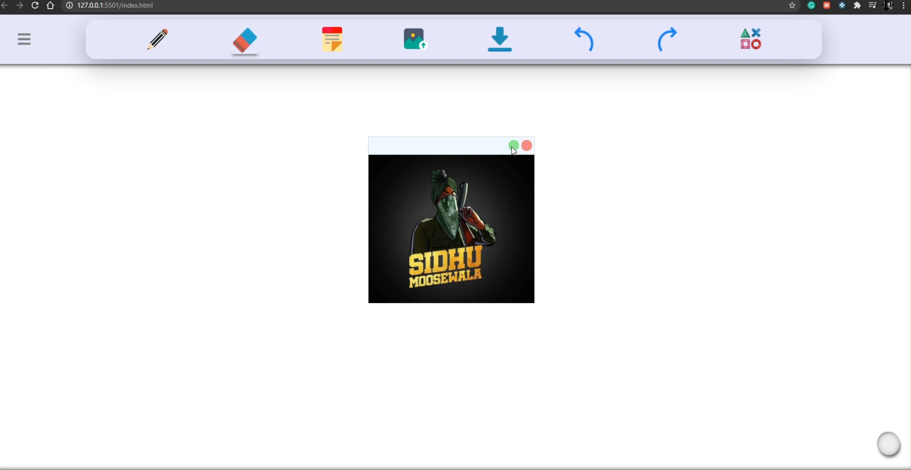

# WhiteBoard
Whiteboards (traditional, digital and web) are found in almost every classroom because it makes it easy for teachers to explain and explore ideas with students.  
A web whiteboard allows a teacher and student(s) to interact on the same online whiteboard web page at the same time…from anywhere. 
In this recent time of pandemic everything has moved online.  
Pandemic has caused a lot of damage to health and economy on the world. 
Due to work people need to get out of their house and raise a threat of getting infected by the virus. Whiteboard help everyone in this situation. 
Whiteboard can be used by everyone, whether be a child or a student or a professional working for an organization can make use of the whiteboard application for expressing their ideas from distance. 
Application is inspired from Microsoft’s whiteboard. It consists of tools: 
•	pencil 
•	eraser 
•	sticky notes 
•	image import 
•	undo 
•	redo 
•	add shapes 
•	add grid 
•	change background 
**Pencil** – User can draw on the canvas. Various color options and stroke styles are available for the user. 
**Eraser** - Mistakes can be erased. Clear Canvas option lets you clear the whole canvas without removing sticky and images. 
**Sticky Notes**- User can write quick notes for reference. 
**Image Import** – Images can be imported from your local computer. 
**Undo** – Strokes from both pencil and eraser can be undo. 
**Redo** – Strokes from both pencil and eraser can be redo. 
**Add Shape** – Circle, square, rectangle, Triangle can be added on canvas. 
**Add Grid** – Add grid on canvas. 
**Change Background** – Change background color of canvas. 
All the drawings on canvas are saved during session in a database. Whiteboard Application is deployed on server.
User can share the link with peers and two way data transfer is possible. 
# Application Link
https://karan1219.github.io/WhiteBoard/app/public/
# Video
https://www.linkedin.com/posts/karanpreet-singh-53475b151_javascript-html-css-activity-6743146153619075072--VOQ
# Screenshots

